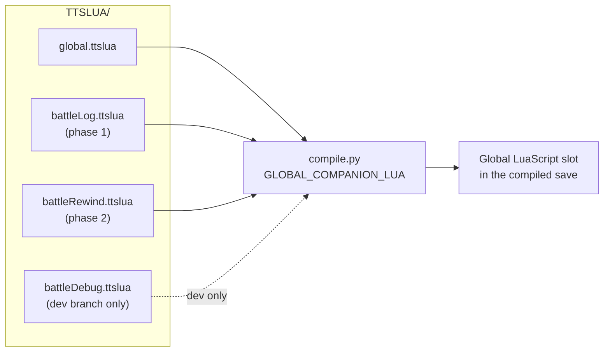
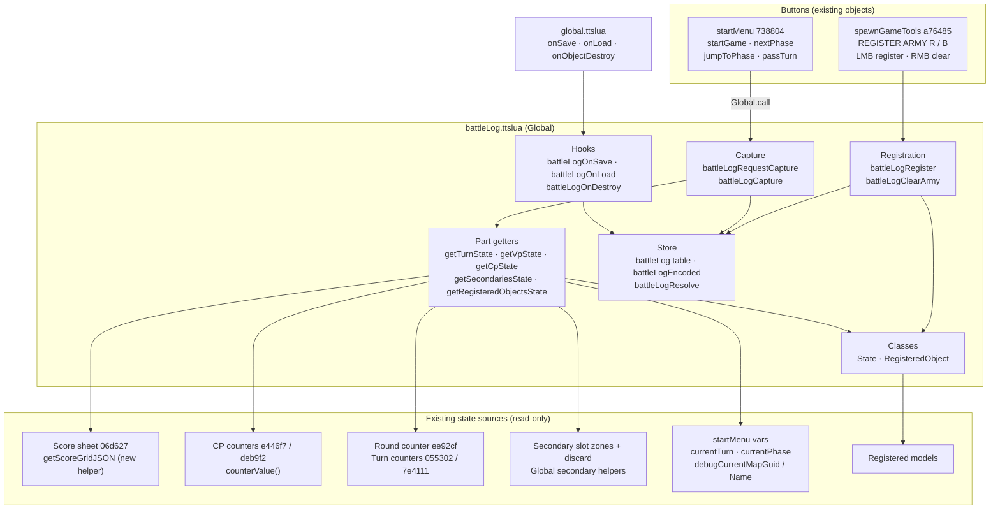
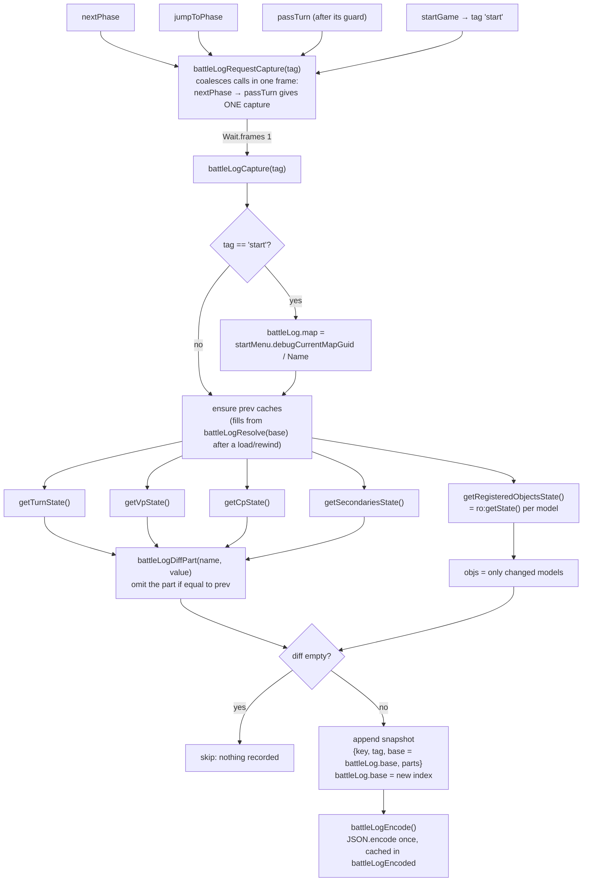
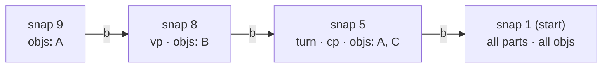
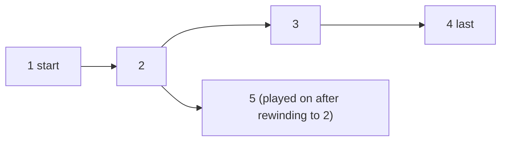
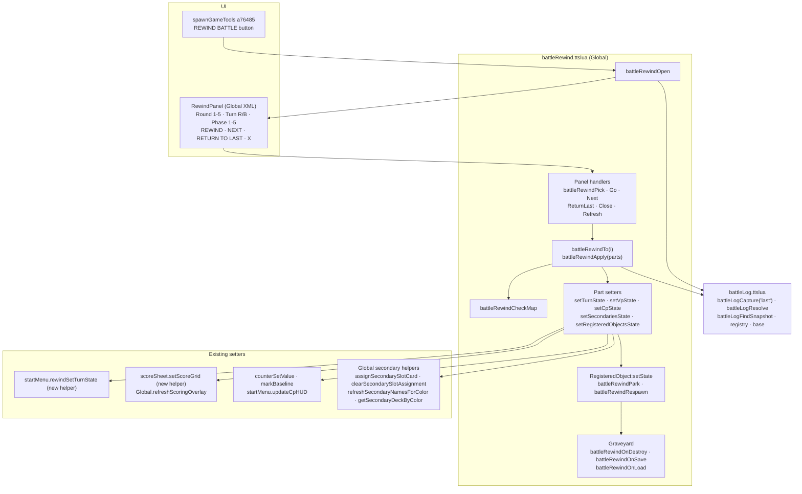
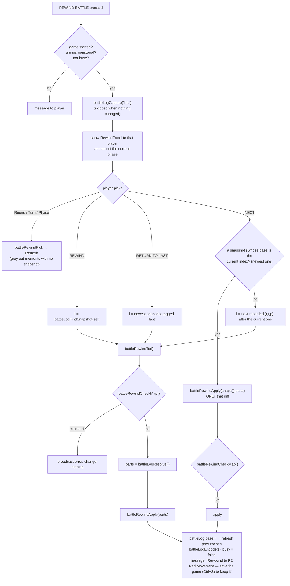
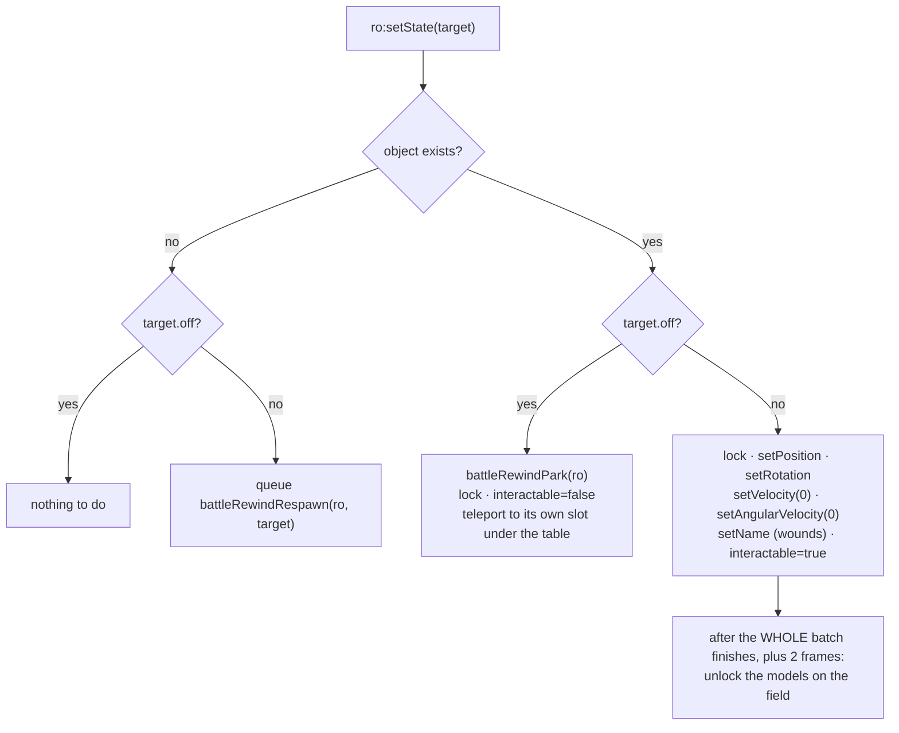
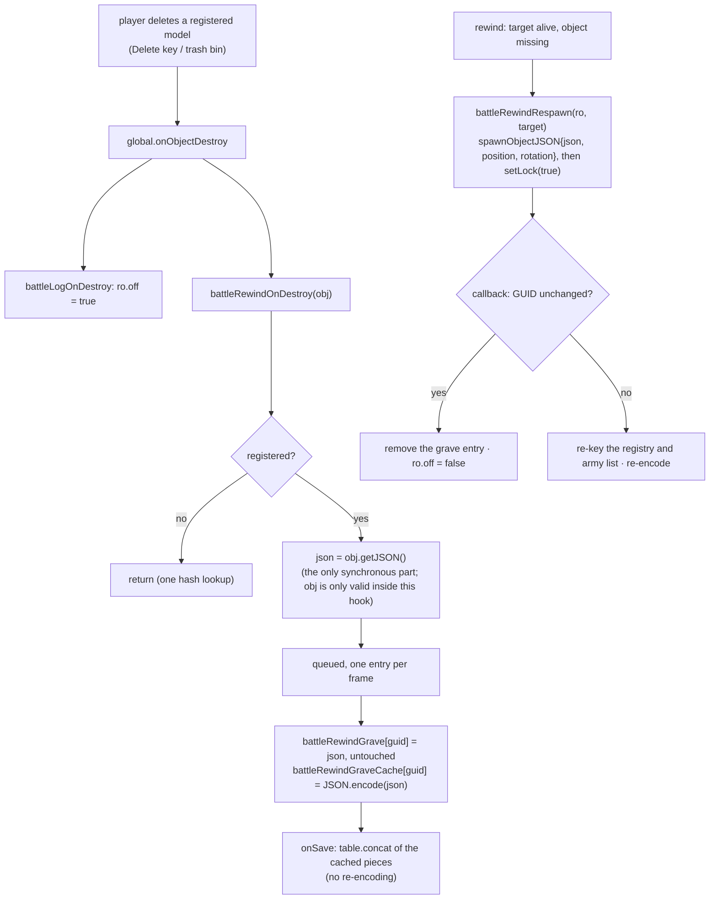
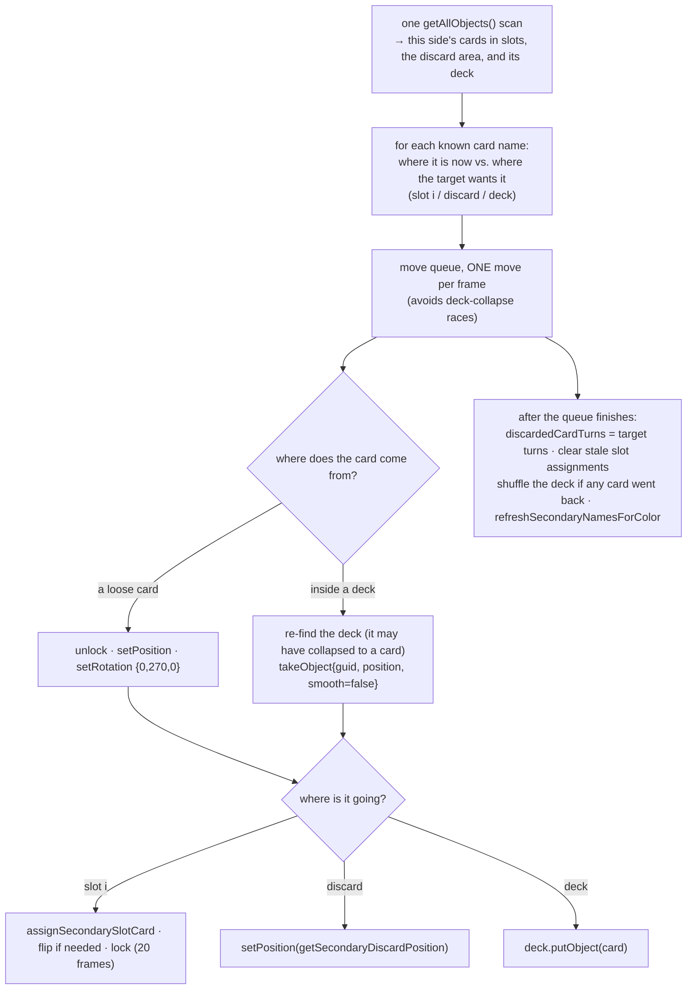

# Battle Log & Battle Rewind: Architecture

> **Status:** Parts A and B are implemented (awaiting in-TTS testing per §6 of
> the plan). This document is binding. Any deviation needs the maintainer's
> approval first, and the document must be updated in the same commit as the
> code it describes. Line budgets are targets, not limits.

There are two features, built in order, each in its own file:

| Phase | Feature | New file | Branch |
|---|---|---|---|
| 1 | **Battle Log**: register armies and record a snapshot at battle start and at every phase change | `TTSLUA/battleLog.ttslua` | `feature/battle-log-v3` (from `main`) |
| 2 | **Battle Rewind**: return the table to any recorded phase | `TTSLUA/battleRewind.ttslua` | `feature/battle-rewind-v3` (from phase 1) |

Debug tools and tests live only on `feature/battle-rewind-v3-dev`, which sits on
top of whichever feature branch is current and is never merged (§C).

## Guiding principles

1. **Short and reviewable.** Aim for roughly 650 changed lines in phase 1 and
   750 in phase 2, not counting this document.
2. **No work outside a button press.** Nothing polls. The one event hook,
   `onObjectDestroy`, does a single hash lookup for any object that isn't
   registered. `onSave` never encodes anything; it only joins strings that were
   already encoded.
3. **Minimal edits to existing files.** New code lives in the new files. The
   existing files only get the hook lines and small helpers listed in §A6 and §B7.
4. **Reuse existing code.** Counters, secondary helpers and HUD setters are
   called as they are. The score-grid helpers and the turn-state setter are
   copied from `feature/battle-log`.
5. **Debug tools stay separate.** They are on the `-dev` branch only.

## How the new files are loaded

Both new files are *Global companions*. They have no GUID header, and
`scripts/compile.py` appends them to `global.ttslua`'s text before injecting the
result into Global's single `LuaScript` slot. Their functions therefore live in
Global's normal environment.



---

# Part A: Battle Log (phase 1) — implemented

## A1. Components



## A2. Capture flow

A capture runs one frame after the press, so it records the **start of the phase
that is now active**, including the CP gained when a turn passes. Its key is that
phase: `(round, turn, phase)`.



## A3. Data shapes

```text
battleLog = {                               -- persisted (as battleLogEncoded)
  v     = 1,                                -- schema version
  map   = {guid = "abc123", name = "..."},  -- set on the 'start' capture
  army  = {Red = {guid, ...}, Blue = {guid, ...}},
  base  = 7,                                -- index the next capture diffs against
  snaps = { snapshot, ... },                -- at most 200 (warning at the cap)
  baseSize = {[guid] = {bx, bz}, ...},       -- half of getBoundsNormalized().size; set once, at registration
}

snapshot = {
  k = {r, t, p},        -- round (number), turn ("Red"|"Blue"), phase (1..5)
  tag = "start" | "phase" | "last",
  b = 6 | nil,          -- base index; nil only for the first snapshot
  parts = {             -- every part is optional (omitted = unchanged from base)
    turn = {r, t, p, rt, bt},            -- round, turn, phase, Red/Blue turn counters
    vp   = "<score grid JSON string>",   -- from the score sheet, stored verbatim
    cp   = {r, b, gr, gb},               -- CP values; GAIN CP round markers
    sec  = {Red = secSide, Blue = secSide},
    objs = {[guid] = stateTuple, ...},   -- changed models only
  },
}

secSide    = {slots = {[i] = {n = name, fd = bool}}, discard = {name, ...}, turns = {[name] = turn}}
stateTuple = {x, y, z, rx, ry, rz, name, off}   -- off = 1 when off the field
```

**`State`** is an in-memory object built from a `stateTuple`:

- `State.new(t)`
- `State.fromObject(obj)`
- `State.equals(a, b)`: position is compared to 0.01, rotation to 0.5°, and the
  name and `off` exactly.
- `state:encode()`

**`RegisteredObject`** has these fields:

- `guid`, `color`
- `prev`: the State most recently captured or restored; a cache
- `off`: true once the model has been destroyed

It has these methods:

- `ro:object()` returns `getObjectFromGUID(guid)`.
- `ro:getState()` reads the current State and returns `nil` if it equals `prev`.
  Otherwise it updates `prev` and returns the new State. A destroyed model reads
  as `off`.
- `ro:setState(state)` is declared here, but its body is attached in
  `battleRewind.ttslua` (phase 2).

The registry is `battleLogRegistry[guid] = RegisteredObject`. It is a Lua table
keyed by GUID string, which is a hash table, so a lookup costs O(1).

**The `prev` rule:** every `prev` cache equals the resolved state at
`battleLog.base`. After a load the caches are empty, and they are filled once, on
demand, from `battleLogResolve(battleLog.base)`. After a rewind to `i`, they are
set from the restored state and `battleLog.base = i`.

## A4. Resolving a snapshot

A snapshot stores only what changed. The full state at `i` is the **most recent
recorded value of each part and each model**. It is found by walking backwards
from `i` along the base links (`b`) and never by replaying from the start.



For example, `battleLogResolve(9)` returns A from snapshot 9, B and `vp` from
snapshot 8, C, `turn` and `cp` from snapshot 5, and everything else from
snapshot 1. The walk stops as soon as every part and every registered model has
a value.

After a rewind, captures take the restored snapshot as their base, so snapshots
can **branch** without breaking any chain:



## A5. Function table: `battleLog.ttslua`

| Function | Called by | What it does | Est. lines |
|---|---|---|---|
| `State.new / fromObject / equals / encode` | log and rewind code | the model state value type | 45 |
| `RegisteredObject.new / object / getState` | log code | wraps one registered model | 35 |
| `isBattleLogModel(obj)` | `battleLogRegister` | the selection filter (a trimmed copy of battle-log's `isBattleModel`): Figurine, Generic or Custom_Model; not locked; no furniture GMNotes; no `BCBtype` | 20 |
| `battleLogRegister(params)` | REGISTER ARMY (LMB) | takes the clicker's selected models, replaces that side's army, records each model's `baseSize` from `getBoundsNormalized()` (rotation-independent, so facing doesn't matter), re-encodes | 40 |
| `battleLogClearArmy(params)` | REGISTER ARMY (RMB) | unregisters a side, drops its `baseSize` entries, re-encodes | 15 |
| `battleLogRequestCapture(tag)` | startMenu hooks | merges calls in the same frame and keeps `start` over `phase` | 15 |
| `battleLogCapture(tag)` | the above, and rewind (`last`) | the capture flow in §A2; returns the new index or the base index | 60 |
| `getTurnState()` | capture | reads the round and turn counters, and startMenu's `currentTurn` / `currentPhase` | 15 |
| `getVpState()` | capture | `sheet.call("getScoreGridJSON")` | 5 |
| `getCpState()` | capture | `counterValue(cpCounterForColor(c))`, `cpGainRoundUsed` | 10 |
| `getSecondariesState()` | capture | **one** `getAllObjects()` scan, sorted into the 8 slot footprints and the discard area of each side; plus `discardedCardTurns` | 50 |
| `getRegisteredObjectsState()` | capture | `ro:getState()` per model, returning changed models only | 15 |
| `battleLogResolve(i)` | capture (to fill `prev`), rewind | the backward walk in §A4; returns `{turn, vp, cp, sec, objs}` | 35 |
| `battleLogFindSnapshot(r, t, p)` | rewind panel | the latest snapshot with that key, excluding `last` | 15 |
| `battleLogEncode()` | register, capture, rewind | `battleLogEncoded = JSON.encode(battleLog)` | 5 |
| `battleLogOnSave()` | `global.onSave` | returns `battleLogEncoded` (no encoding here) | 3 |
| `battleLogOnLoad(data)` | `global.onLoad` | receives the already-decoded `svBattleLog` table, checks `v`, rebuilds the registry and re-encodes the cache once | 25 |
| `battleLogOnDestroy(obj)` | `global.onObjectDestroy` | `local ro = battleLogRegistry[guid]; if ro then ro.off = true end` | 5 |
| **Total** | | | **~430** |

**Why `getSecondariesState` does its own scan:**

- The existing `getCardsInSecondarySlot` calls `getAllObjects()` every time it
  runs. Using it for 16 slots would mean 16 full scans on every phase press, and
  changing its signature would edit tested code.
- The new function applies the same footprint test (zone bounds, `0.5 < y < 3`)
  in one pass.
- It reads raw card names. `getDiscardedSecondaryNames` adds a turn suffix, so
  its names can't be matched.

## A6. Edits to existing files (phase 1)

| File | Where | Change | Lines |
|---|---|---|---|
| `scripts/compile.py` | constants, `collect_lua_files`, Global injection | add `GLOBAL_COMPANION_LUA = ["battleLog.ttslua"]`; skip these files in the GUID scan; append them to Global's text (copied from battle-log) | ~20 |
| `TTSLUA/global.ttslua` | `onSave` (l.1261) | add the pre-encoded blob as a raw JSON value: `saved_data = saved_data:sub(1, -2) .. ',"svBattleLog":' .. battleLogOnSave() .. '}'` | 1 |
| | `onLoad` (l.1382) | `battleLogOnLoad(loaded_data.svBattleLog)` | 1 |
| | `onObjectDestroy` (l.1373) | `battleLogOnDestroy(obj)` after the nil guard | 1 |
| `TTSLUA/startMenu.ttslua` | end of `startGame` (5504), `nextPhase` (5733), `jumpToPhase` (5702), `passTurn` (5749) | `Global.call("battleLogRequestCapture", tag)` | 4 |
| | `onSave` (249) / `onLoad` (125) | persist `debugCurrentMapGuid` / `debugCurrentMapName` | 4 |
| `TTSLUA/11eScoreSheet.ttslua` | new function | `getScoreGridJSON()` (from battle-log l.1025) | ~25 |
| `TTSLUA/spawnGameTools.ttslua` | button table, `createMenu`, handlers | REGISTER ARMY R/B, one row in from HIDE/SHOW ARMY, forwarding to Global | ~30 |
| `CHANGELOG.md`, `README.md` | | short notes | ~15 |

---

# Part B: Battle Rewind (phase 2) — implemented

## B1. Components



## B2. Rewind flows



`battleRewindApply(parts)` calls only the setters for parts that are present, in
this order:

1. `setTurnState`
2. `setVpState`
3. `setCpState`
4. `setSecondariesState`: a card queue, one move per frame
5. `setRegisteredObjectsState`: 25 models per frame, plus 4 respawns per frame

It then waits for both queues to finish before clearing the busy flag.

**How the panel chooses snapshots:**

- **Grid:** each round/turn/phase cell uses the *latest* snapshot with that key
  that isn't tagged `last`.
- **Snapshots from an abandoned future stay usable.** If a player rewinds and
  plays on, a key they haven't replayed yet still points at the old recording,
  and that recording still resolves correctly along its own chain.
- **NEXT prefers a direct child** (a snapshot whose base is the current index),
  because it can apply that diff alone.

## B3. Moving a model (`RegisteredObject:setState`)

Checked against the TTS API:

- `setPosition` and `setRotation` are instant teleports. Only the `*Smooth`
  variants animate, and they are not used.
- TTS has no per-object switch to turn collisions off. `setLock(true)` makes an
  object kinematic, which takes it out of the physics simulation.



**Parked models:**

- A locked object isn't simulated at all: no gravity, no falling, no settling.
  `interactable = false` stops anyone grabbing it through the table.
- Parked models sit under the table (`y = -10`), one slot each, in a grid per
  side.
- Rewind never destroys a model. Dead at the target means parked; alive means
  unparked.

## B4. Deleted models: store on delete, spawn only when needed



**Why the rewind spawns the model instead of the delete:**

- No hidden models exist during play, so nothing extra appears in scans such as
  the dice mats' `getAllObjects()`.
- There is no revive loop.
- There is no GUID race: the original is long gone by the time the rewind spawns
  the copy.

**The raw JSON is never parsed, on either end.** An earlier version of this
file ran `JSON.decode` on the model's full JSON at delete time, to pool its
long script/UI/description fields into shared storage. In testing that decode
alone measured 5+ seconds for one model -- which is what actually froze the
game on delete, not the `getJSON()` call itself (measured at ~1ms). Since
`spawnObjectJSON`'s own `position`/`rotation` parameters override whatever
transform is baked into the JSON, and `GUID`/lock/name are all handled after
spawning via plain object calls, nothing here ever needs the JSON's contents
-- it's carried through delete, save, load and respawn as an opaque string.
The trade-off is a bigger save file (no cross-model string sharing: a model
with its datasheet script and UI is about 98 KB, stored once per dead model
instead of pooled), which is a fair price for not freezing during play.

**Scrubbing is only slow the first time.** Once a model has been respawned, a
later "dead" target parks it instead of deleting it, so moving back and forth
afterwards is just teleports.

## B5. Restoring secondaries (`setSecondariesState`)

Each side is handled independently. Cards are matched by **name**, and the search
is limited to that side's slots, its discard area and its secondary deck, so a
Red card is never moved into a Blue slot.



A card that can't be found (for example, one that was deleted) is reported in chat
and skipped. There is no card graveyard; see §D.

## B6. Function table: `battleRewind.ttslua`

| Function | Called by | What it does | Est. lines |
|---|---|---|---|
| `battleRewindOpen(params)` | REWIND BATTLE | guards, captures `last`, shows the panel | 25 |
| `battleRewindRefresh()` | the handlers | greys out missing moments, highlights the selection, sets the status line | 45 |
| `battleRewindPick(player, _, id)` | round / turn / phase buttons | reads the value from the element id (`RewindRound3`, `RewindTurnRed`, `RewindPhase2`) | 15 |
| `battleRewindGo / battleRewindNext / battleRewindReturnLast / battleRewindClose` | panel buttons | the flows in §B2 | 45 |
| `battleRewindCheckMap()` | `battleRewindTo`, NEXT | compares `battleLog.map.guid` with startMenu's `debugCurrentMapGuid` | 10 |
| `battleRewindTo(i)` | Go, ReturnLast, Next fallback | busy flag → map check → resolve → apply | 25 |
| `battleRewindApply(parts, i)` | `battleRewindTo`, Next | runs the present setters in order and finishes the rewind when both queues are empty | 30 |
| `setTurnState(turn)` | apply | sets the round and turn counters (`counterSetValue` + `updateHUD`), then `startMenu.call("rewindSetTurnState", {turn, phase})` | 15 |
| `setVpState(json)` | apply | `sheet.call("setScoreGrid", json)`, then `refreshScoringOverlay()` | 5 |
| `setCpState(cp)` | apply | `counterSetValue` + `markBaseline` for each side; `cpGainRoundUsed`; `startMenu.call("updateCpHUD")` | 15 |
| `setSecondariesState(sec, done)` | apply | §B5 | 110 |
| `setRegisteredObjectsState(objs, done)` | apply | queues `ro:setState` in batches of 25, then the unlock pass | 30 |
| `RegisteredObject:setState(state)` | the queue | §B3 | 30 |
| `battleRewindPark(ro)` | `setState` | lock, hide and teleport to the park slot | 15 |
| `battleRewindRespawn(ro, state)` | `setState` (queued, 4 per frame) | §B4, including the GUID check | 30 |
| `battleRewindOnDestroy(obj)` | `global.onObjectDestroy` | §B4: store only, no spawn | 30 |
| `battleRewindOnSave() / battleRewindOnLoad(data)` | `global.onSave` / `onLoad` | join the cached graveyard pieces (raw JSON strings, no pooling); on load, take the already-decoded table and rebuild the cache | 15 |
| **Total** | | | **~540** |

## B7. Edits to existing files (phase 2)

| File | Where | Change | Lines |
|---|---|---|---|
| `scripts/compile.py` | `GLOBAL_COMPANION_LUA` | add `"battleRewind.ttslua"` | 1 |
| `TTSLUA/global.ttslua` | `onObjectDestroy` | `battleRewindOnDestroy(obj)` | 1 |
| | `onSave` / `onLoad` | `,"svBattleGrave":` .. `battleRewindOnSave()`; `battleRewindOnLoad(loaded_data.svBattleGrave)` | 2 |
| `TTSLUA/startMenu.ttslua` | new function | `rewindSetTurnState(params)`, adapted from battle-log's `battleSetTurnState`: sets `currentTurn` and `currentPhase`, calls `writeMenus` and `updateGameStateHUD`, and records nothing | ~20 |
| `TTSLUA/11eScoreSheet.ttslua` | new function | `setScoreGrid(raw)` (from battle-log l.1052) | ~30 |
| `TTSLUA/spawnGameTools.ttslua` | button table, `createMenu`, handler | REWIND BATTLE, next to REGISTER ARMY on each side | ~15 |
| `TTSJSON/ftc_base_ui.xml` | new panel | a single `RewindPanel` (markup trimmed from battle-log's overlay). Visibility is set to the colours that have it open. | ~40 |
| `TTSLUA/global.ttslua` | `playerHudSettings` / `getDefaultHudSettings` / `applyHudPreferencesForColor` / `hudToggleHelp` / `hudToggleLock` | a `rewindOverlayOpen` flag, following the existing `helpOverlayOpen`/`scoringOverlayOpen` pattern: added to both HUD-settings tables, applied to the panel's `active` attribute, and cleared by the other two toggles so only one overlay is open at a time | ~10 |
| `CHANGELOG.md`, `README.md` | | short notes | ~15 |

---

# Part C: Dev branch (`feature/battle-rewind-v3-dev`)

This branch only adds files, plus one line in the companion list. It is rebased
onto the current feature branch after every feature commit and is never merged.

| File | Purpose |
|---|---|
| `TTSLUA/battleDebug.ttslua` | Global companion. Each function returns early unless `DEBUG` is set. `battleDebugDump(i)` prints a snapshot and its resolved state. `battleDebugCheckChain()` checks every base link and every resolve. `battleDebugSimulateDelete(guid)` deletes a model through the normal path. `battleDebugTimeCapture()` times a capture and a resolve. |
| `scripts/tts_console.py`, `scripts/test_tts_console.py` | copied from battle-log: an External Editor API console (ports 39998/39999) that maps error lines back to source files |
| `.vscode/tasks.json` | copied from battle-log: TTS console, test build, and test tasks |
| `scripts/lua_strings.py` + a check in `compile.py` | fails the build on an unterminated string, since TTS otherwise drops the whole script silently |
| `compile.py --branch` | tags test builds per branch so the two worktrees don't overwrite each other's copy in the TTS saves folder |
| `scripts/test_battle_log_rewind.py` | Static checks: the hooks exist, `onSave` does no encoding, there are no repeating timers, and the companion files contain no `!=`. Plus `lupa` (`lupa.lua52`) tests of `State.equals`, diffing, `battleLogResolve` and branching, which are skipped when `lupa` isn't installed. |

---

# Part D: Known limitations and open checks

Changing any of these needs approval first.

1. **There is no Lua save API.** TTS offers nothing to trigger a save, so the
   `last` snapshot is kept by the next save and the rewind message tells players
   to save. The API does have `storeRewindState()`, which adds a point to TTS's
   own undo history. It is not used; adding it needs approval.
2. **The trash bin.** Models dropped into the vortex bin enter a container and
   are removed by `reset()`. It still has to be checked in TTS whether that fires
   `onObjectDestroy`. If it doesn't, catching it needs another hook, which needs
   approval.
3. **The map check uses the GUID of the last map card loaded.**
   `debugCurrentMapGuid` isn't cleared by Clear Table or Back to Selection. A
   table that was cleared and never reloaded therefore still passes the check.
4. **A deleted secondary card can't be restored.** It is reported in chat. A card
   graveyard would add code.
5. **A secondary deck that collapses to a single card** after most of it has been
   drawn isn't handled. The existing draw code has the same limitation.
6. **Snapshots are capped at 200**, with a warning. A full five-round game uses
   about 50.
7. **Save size target:** under about 500 KB of log data. The graveyard has no
   pooling (see §B4), so it costs roughly 98 KB per dead model with no sharing
   across a unit -- a heavy-casualty game could run into the low single-digit
   MB. Measured on the dev branch.
